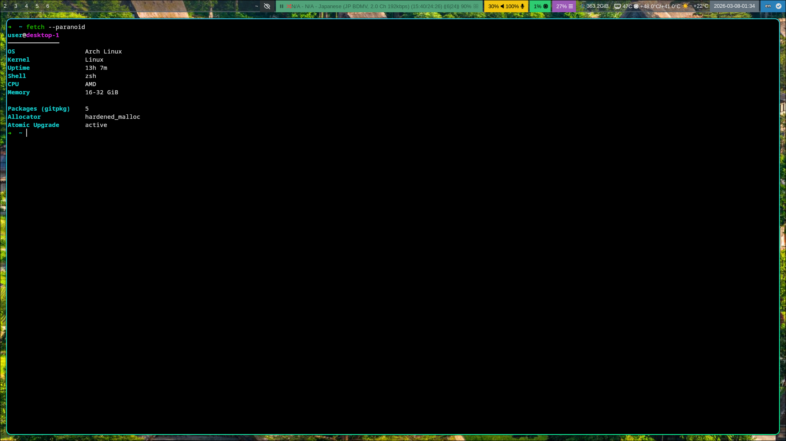

# Dotfiles



Arch Linux dotfiles, managed with [chezmoi](https://www.chezmoi.io/).

## What's included

- **WM**: Hyprland (via [uwsm](https://github.com/Vladimir-csp/uwsm)) + waybar + hyprpaper + hypridle/hyprlock + hyprsunset
- **Terminal**: kitty + zsh
- **Editor**: neovim + lazygit
- **Files**: lf + thunar
- **Audio**: mpd + ncmpcpp + mpv
- **Audio switching**: audio-device-switcher (PipeWire sink selection via wpctl + dmenu)
- **Bluetooth**: bt-audio (connect/disconnect paired BT audio devices via dmenu, auto-switch PipeWire sink)
- **Screenshots**: swappy (annotation tool)
- **Input**: fcitx5 + kkc (Japanese)
- **Theme**: Materia GTK + Kvantum + Papirus icons
- **Browser**: Firefox (flatpak, arkenfox user.js with overrides)
- **Cloud sync**: Nextcloud (sandboxed, autostart via XDG desktop entry + D-Bus activation service)
- **Proxy**: sing-box (config download + runner script, per-host URL from secrets)
- **Encrypted vault**: keys-vault (gocryptfs FBE for `~/keys`, passphrase in GNOME Keyring, systemd user service with stale FUSE recovery)
- **Scripts**: ffmpeg\_jp (Japanese audio extraction), rename\_subs (subtitle renaming by episode), cabl (clipboard plumber / search dispatcher via dmenu), wofi-launcher (sandboxed application launcher with icons and usage sorting), dmenu (sandboxed wofi wrapper for dmenu compatibility)

## Per-host configuration

Feature flags are set via `chezmoi init` prompts and stored in `~/.config/chezmoi/chezmoi.toml`:

| Variable | Description |
|---|---|
| `nvidia` | NVIDIA GPU (env vars, packages, waybar gpu\_temp) |
| `amd_cpu` | AMD CPU temp sensors (Tctl/Tccd1 vs generic) |
| `laptop` | Battery, backlight, natural scroll, disable touchpad while typing, compact fonts, bluetooth packages |
| `tablet` | OpenTabletDriver (otd-daemon) |
| `ocr` | transformers\_ocr (systemd user service + keybind) |
| `goldendict` | GoldenDict-ng (wrapper, config, package) |
| `subs2srs` | [subs2srs](https://gitlab.com/fkzys/subs2srs) + SubsReTimer (wrappers, desktop entries, packages) |
| `sparrow` | sparrow-wallet (wrapper) |
| `portproton` | PortProton (flatpak + alias) |
| `virt_manager` | QEMU / virt-manager / dnsmasq |

Per-host data (monitor line, wallpaper path, container graphroot, directory aliases) is stored in `secrets.enc.yaml` under each application's key, keyed by hostname.

## Encrypted vault (`keys-vault`)

`keys-vault` provides file-based encryption for `~/keys` using [gocryptfs](https://github.com/rfjakob/gocryptfs). The encrypted ciphertext lives in `~/.keys.enc/`; the plaintext is mounted at `~/keys/` via FUSE.

The passphrase is stored in GNOME Keyring (via `secret-tool`) for automatic unlock — no interactive prompt on login.

### Lifecycle

| Event | Action |
|---|---|
| Login | `keys-vault.service` (oneshot, `RemainAfterExit`) mounts the vault via `keys-vault open` |
| Login (after vault) | `ssh-add.service` loads SSH keys from the vault via `ssh-add-keys` (4 h lifetime) |
| Screen lock | `ssh-add -D` + `keys-vault close` — flushes SSH keys and unmounts the vault before locking |
| Screen unlock | `keys-vault open` + `ssh-add-keys` — re-mounts the vault and reloads SSH keys after hyprlock exits |

### Systemd integration

The vault and SSH key loading are managed by two user services:

- **`keys-vault.service`** — oneshot service that mounts the vault on login (`After=gnome-keyring-daemon.service`). `ExecStop` unmounts on logout.
- **`ssh-add.service`** — oneshot service that loads all keys from `~/keys/ssh/` into `ssh-agent` with a 4-hour lifetime (`After=ssh-agent.service keys-vault.service`, `Requires` both).

Both are enabled at `WantedBy=default.target` / `graphical-session.target` via the chezmoi enable-services hook.

### Stale mount recovery

If the gocryptfs process dies (e.g. OOM kill, crash) the FUSE mountpoint becomes stale — it appears in `/proc/mounts` but `stat` fails with "Transport endpoint is not connected". `keys-vault` detects this condition and automatically recovers:

- **`open`** calls `recover_stale` before attempting to mount, force-unmounting the dead mountpoint and re-mounting cleanly.
- **`close`** detects stale mounts and force-unmounts them.
- **`status`** reports `stale` as a distinct state.

### Commands

| Command | Description |
|---|---|
| `keys-vault init` | Create encrypted volume, store passphrase in keyring (random or user-supplied) |
| `keys-vault open` | Mount vault (passphrase from keyring); recovers stale mounts; no-op if already mounted or not initialized |
| `keys-vault close` | Unmount vault; handles stale mounts; no-op if not mounted |
| `keys-vault status` | Print state: `open` / `locked` / `stale` / `not initialized` |
| `keys-vault passwd` | Rotate gocryptfs passphrase and update keyring |

### SSH integration

SSH keys are loaded proactively at login and after screen unlock via `ssh-add-keys`, which adds all keys from `~/keys/ssh/` to `ssh-agent` with a 4-hour lifetime. `AddKeysToAgent` is set to `no` — keys are managed explicitly by the service/script rather than on first use.

```
AddKeysToAgent no
IdentityFile ~/keys/ssh/id_ed25519
```

On lock, `ssh-add -D` flushes the agent and the vault is unmounted, so keys are inaccessible while the screen is locked. On unlock, the vault is re-mounted and keys are reloaded immediately.

## Memory allocator hardening

[hardened\_malloc](https://github.com/GrapheneOS/hardened_malloc) is deployed system-wide via `/etc/ld.so.preload` (light variant) and per-app via bwrap `LD_PRELOAD` (default variant). Installed as a separate package via [gitpkg](https://gitlab.com/fkzys/gitpkg) — see [hardened_malloc](https://gitlab.com/fkzys/hardened_malloc).

The light variant provides zero-on-free, slab canaries, and guard slabs. The default variant adds slot randomization, write-after-free checks, and slab quarantines.

GTK4 uses [glycin](https://gitlab.gnome.org/GNOME/glycin) for image loading, which sets `RLIMIT_AS` on its sandboxed loader processes. This is incompatible with hardened\_malloc's large virtual memory reservation (~240 GB `PROT_NONE` guard regions). A `libfake_rlimit.so` shim intercepts `prlimit64(RLIMIT_AS)` calls, returning success without applying the limit.

Applications with incompatible custom allocators (e.g. PartitionAlloc in QtWebEngine) have hardened\_malloc disabled inside their bwrap namespace via `--unsetenv LD_PRELOAD` and `--ro-bind /dev/null /etc/ld.so.preload`.

| Allocator | Applications |
|---|---|
| default (via bwrap) | imv, keepassxc, krita, mpv, obs, nvim, lazygit, qbittorrent, gimp, swappy, makepkg, fcitx5, nextcloud, otd-daemon, sparrow, transformers\_ocr, subs2srs, subsretimer, wofi-launcher, dmenu (wofi) |
| light (system-wide) | hyprland, waybar, kitty, thunar, all other native processes |
| disabled | anki, goldendict (PartitionAlloc / QtWebEngine) |
| not applicable | flatpak apps (own runtime) |

## Application sandboxing

GUI and CLI applications are sandboxed via [bubblewrap](https://github.com/containers/bubblewrap) wrappers in `~/.local/bin/`. A shared library [bwrap-common](https://gitlab.com/fkzys/bwrap-common) (`/usr/lib/bwrap-common/bwrap-common.sh`) provides reusable helpers for GPU, Wayland/X11, audio, D-Bus, filesystem setup, and hardened\_malloc integration.

Before sourcing, each wrapper validates the library with [verify-lib](https://gitlab.com/fkzys/verify-lib) — a compiled binary that checks file ownership, permissions, and symlink integrity:

```sh
_src() { local p; p=$(verify-lib "$1" "$2") && . "$p" || exit 1; }
_src /usr/lib/bwrap-common/bwrap-common.sh /usr/lib/bwrap-common/
```

AUR builds via `yay` and `aurutils` are sandboxed — `makepkg` runs inside bwrap with `$HOME` as empty tmpfs, preventing PKGBUILD `build()` from accessing SSH keys, configs, or other sensitive data. The wrapper replaces `-s`/`--syncdeps` with `-d`/`--nodeps` and strips `-r`/`--rmdeps`, since bwrap's `no_new_privs` prevents `sudo pacman` inside the sandbox and both `yay` and `aurutils` resolve dependencies before calling `makepkg`. A no-op fakeroot shim is injected into `PATH` inside the sandbox to bypass incompatibility between real fakeroot's `LD_PRELOAD` interposition and hardened\_malloc — the shim sets a dummy `FAKEROOTKEY` and exec's the wrapped command directly; package tarball ownership is handled by makepkg's `bsdtar --uid/--gid` flags independently of fakeroot. Build output directories (`PKGDEST`, `SRCPKGDEST`, `LOGDEST`, `BUILDDIR`) are bind-mounted into the sandbox when set by the caller.

System desktop entries are overridden in `~/.local/share/applications/` to redirect `Exec=` to the bwrap wrappers, ensuring applications launch sandboxed from application launchers and file associations.

Flatpak applications have per-app permission overrides in `~/.local/share/flatpak/overrides/`.

Nextcloud and fcitx5 are launched via XDG autostart desktop entries (`~/.config/autostart/`) instead of systemd user services. The desktop entries use templated paths pointing to the bwrap wrappers. Nextcloud also has a D-Bus activation service (`~/.local/share/dbus-1/services/`) for on-demand startup.

subs2srs and SubsReTimer have XDG desktop entries (`~/.local/share/applications/`) for launcher integration.

| Application | Display | Network | Notes |
|---|---|---|---|
| anki | Wayland | yes | QtWebEngine, Anki2 data dir, Downloads/anki, audio sources dir + subs2srs dir from secrets |
| dmenu (wofi) | Wayland | no | Sandboxed wofi --dmenu wrapper, config/cache dirs |
| fcitx5 | Wayland | no | Input method daemon, socket dir shared via `/tmp/fcitx5-$UID`, D-Bus session access |
| gimp | Wayland | no | Pictures/Downloads rw |
| goldendict | XWayland | yes | Dictionary + audio dirs from secrets, fcitx5 input |
| imv | Wayland | no | Read-only file viewer, fontconfig |
| keepassxc | Wayland | no | DB dir from secrets, fcitx5 input, isolated from network |
| krita | XWayland | no | Separate config dir trick, Pictures/Downloads rw, audio, fcitx5 input |
| lazygit | terminal | yes | CWD bind, SSH agent forwarding |
| mpv | Wayland | yes | subs2srs/mpvacious, Anki2 integration, watch\_later + watched state dirs, Screenshots |
| nextcloud | Wayland | yes | Sync dir from secrets, filtered D-Bus (secrets + kwallet), GNOME keyring forwarding |
| nvim | terminal | yes | CWD + file args, clipboard via Wayland |
| obs | Wayland | yes | Camera devices, Videos dir |
| otd-daemon | Wayland (no GUI) | no | OpenTabletDriver daemon, full `/dev` access for tablet devices, Wayland socket for tablet mapping |
| qbittorrent | Wayland | yes | Download dirs from secrets |
| sparrow | XWayland | yes | Bitcoin wallet, `/opt/sparrow` read-only bind, Java AWT non-reparenting, filtered D-Bus |
| subs2srs | Wayland | no | Native binary, media dir read-only from secrets, output + log dirs writable, audio, fcitx5 input |
| subsretimer | XWayland | no | Mono/.NET app (SubsReTimer.exe), media dir read-only from secrets, output dir writable, fcitx5 input |
| swappy | Wayland | no | Screenshots dir, D-Bus system access |
| transformers\_ocr | Wayland | yes | OCR daemon (foreground) sandboxed with GPU access, Python venv read-only; IPC runtime dir bind-mounted for host↔sandbox FIFO/PID visibility; filtered D-Bus; client commands (recognize, hold, stop) run unsandboxed on host |
| wofi-launcher | Wayland | no | Application launcher; .desktop parsing + icon lookup on host, wofi display inside sandbox; icon dirs read-only, usage cache writable |
| yay / aurutils (makepkg) | — | yes | `$HOME` is tmpfs, `-s`→`-d` / `-r` stripped (no\_new\_privs blocks sudo), no-op fakeroot shim (hardened\_malloc compat), build dir + `PKGDEST`/`SRCPKGDEST`/`LOGDEST`/`BUILDDIR` writable |

Per-host data directories (media paths, download dirs) are configured in `secrets.enc.yaml` under each application key, keyed by hostname.

For the full list of bwrap-common functions and wrapper patterns, see [bwrap-common](https://gitlab.com/fkzys/bwrap-common).

## lf file manager

### Previews

Video and image previews use kitty's `icat` protocol. Videos get cached thumbnails via `ffmpegthumbnailer`.

For videos with saved mpv playback position, the resume point and total duration are overlaid on the thumbnail (e.g. `⏸ 12:34 / 25:20`). Fully watched videos (no `watch_later` entry but a marker in `~/.local/state/lf/watched/`) show a `▣` badge with total duration. The previewer reads mpv's `watch_later` state files and the watched markers (both keyed by MD5 of the absolute path) and annotates via ImageMagick. Font is auto-detected from common system paths with `fc-match` as fallback.

The previewer runs inside a bwrap sandbox with read-only access to the video directory, lf config, vidthumb cache, mpv watch\_later state, and lf watched markers. Only the vidthumb cache is writable.

### Watch tracking

An mpv script (`mark-watched.lua`) creates watched markers on playback completion (EOF) and removes them when a file is replayed.

After mpv exits, lf auto-refreshes the preview. An `on-select` hook displays the mpv resume position in the status bar when navigating to a video with saved state (e.g. `⏸ 12:34`), or `▣ watched` for fully watched videos.

### Keybindings

| Key | Action |
|---|---|
| `m` | Play with mpv (auto-refreshes preview on exit) |
| `n` | Edit with nvim |
| `o` | Extract Japanese audio (ffmpeg\_jp) |
| `Ctrl-B` | Rename subtitles to match videos |

## Shell (zsh)

No framework (oh-my-zsh, etc.) — prompt, completions, keybindings are configured manually.

### Prompt

robbyrussell-style prompt with inline git branch + dirty indicator (`✗`), implemented as a shell function (no plugin).

### PATH

`~/.local/bin` is prepended to `$PATH` via zsh's `path` array, deduplicated with `typeset -U path`.

### Plugins

- [zsh-autosuggestions](https://github.com/zsh-users/zsh-autosuggestions) — fish-like suggestions
- [zsh-syntax-highlighting](https://github.com/zsh-users/zsh-syntax-highlighting) — command highlighting

### Tools

- [zoxide](https://github.com/ajeetdsouza/zoxide) — smart `cd`
- [fzf](https://github.com/junegunn/fzf) — fuzzy finder (`Ctrl-T` files, `Alt-C` dirs, `Ctrl-R` history)
- [direnv](https://direnv.net/) — per-directory env

FZF uses `fd` for file/dir discovery and `bat`/`eza` for previews.

### Completion

Interactive menu with arrow navigation, case-insensitive matching, `LS_COLORS`, grouped by type.

### Aliases

| Alias | Expands to |
|---|---|
| `ls`, `ll`, `la`, `lt`, `l.` | `eza` variants (color, dirs first, git status, tree) |
| `cat` | `bat --paging=never` |
| `ccat` | `bat --paging=never --style=full --color=never` |
| `catp` | `bat` with pager |
| `rg` | `ripgrep --smart-case` |
| `vi`, `vim` | `nvim` |
| `lg` | `lazygit` |
| `start-hyprland` | `exec uwsm start start-hyprland` |
| `g`, `ga`, `gc`, `gco`, `gd`, `gl`, `gp`, `gst`, `glog` | git shorthands |
| Flatpak apps | `firefox`, `telegram`, etc. → `flatpak run <id>` (generated from a map, conditional on feature flags) |
| Directory aliases | Per-host `cd` shortcuts from `secrets.enc.yaml` (e.g. `anime`, `subs`) |

### Functions

| Function | Description |
|---|---|
| `bcat` | `bat` with decorations → `wl-copy` (copy file with line numbers to clipboard) |

### Keybindings

| Key | Action |
|---|---|
| `Ctrl-O` | Launch `lf` |
| `Ctrl-F` | `fzf-cd-widget` (fuzzy cd) |
| `Ctrl-N` | Launch `ncmpcpp` |
| `Ctrl-T` | fzf file search |
| `Alt-C` | fzf directory search |
| `Up` / `Down` | History search by prefix |
| `Ctrl-Left` / `Ctrl-Right` | Word navigation |
| `Ctrl-Backspace` / `Ctrl-Delete` | Kill word backward/forward |

### Environment

| Variable | Value |
|---|---|
| `EDITOR` | `nvim` |
| `MANPAGER` | `bat` as man pager (with `col -bx`) |
| `MAKEFLAGS` etc. | Parallel builds (`-j$(nproc)`) for make, cmake, ninja, meson, dpkg |
| `SOPS_AGE_KEY_FILE` | Age key path for sops decryption |

## Systemd user services

| Service | Type | Description |
|---|---|---|
| `ssh-agent` | — | SSH agent daemon (`SSH_AUTH_SOCK` at `$XDG_RUNTIME_DIR/ssh-agent.socket`) |
| `keys-vault` | oneshot, `RemainAfterExit` | Mounts gocryptfs vault (`~/keys`) on login, unmounts on stop. After `gnome-keyring-daemon`. |
| `ssh-add` | oneshot, `RemainAfterExit` | Loads all SSH keys from `~/keys/ssh/` into agent (4 h lifetime). Requires `ssh-agent` + `keys-vault`. |
| `hypridle` | — | Idle daemon |
| `hyprpaper` | — | Wallpaper daemon |
| `hyprpolkitagent` | — | Polkit agent |
| `hyprsunset` | — | Night light. Override filters `[TRACE]` log spam via `grep -v` and uses `KillMode=control-group` for clean shutdown. |
| `waybar` | — | Status bar |
| `mpd` | — | Music player daemon |
| `transformers_ocr` | — | OCR daemon (conditional on `ocr` flag). Drop-in override replaces `ExecStart` with `transformers_ocr start --foreground` using `%h` for home directory resolution. |

All user services are enabled via a chezmoi `run_onchange_after` hook (templated to conditionally include `transformers_ocr` when the `ocr` flag is set). System services enabled: `firewalld`, `systemd-oomd`.

## Standalone scripts (`~/.local/bin/`)

| Script | Description |
|---|---|
| `ffmpeg_jp` | Extract Japanese audio track from video files as opus. Accepts a file, directory, or `$LF_SELECTED_FILES` from lf. Auto-detects Japanese track by language tag or title; falls back to the only track if there is exactly one. Two-phase pipeline: demux (I/O-bound, low parallelism) → encode (CPU-bound, high parallelism). |
| `rename_subs` | Rename subtitle files (.srt, .ass, .sub) to match video filenames by episode number. Supports patterns like S01E05, 1x05, Ep05, Episode 05, bare numbers, and --dry-run. |
| `audio-device-switcher` | Switch default PipeWire audio output device via `wpctl` + `dmenu`. |
| `bt-audio` | Connect/disconnect paired Bluetooth audio devices via `dmenu`, auto-switch PipeWire sink on connect. |
| `cabl` | Clipboard plumber — reads selection/clipboard, presents context-sensitive actions via `dmenu`: dictionary lookups, Anki card creation, Forvo audio download, mecab headword extraction, media downloads, QR codes, man pages. |
| `keys-vault` | Encrypted vault manager for `~/keys` — gocryptfs FBE with passphrase in GNOME Keyring. Commands: `init`, `open`, `close`, `status`, `passwd`. Detects and recovers stale FUSE mounts. Managed by `keys-vault.service`. |
| `ssh-add-keys` | Loads all SSH keys from `~/keys/ssh/` into `ssh-agent` with a 4-hour lifetime. Used by `ssh-add.service` and the lock/unlock script. |
| `wofi-launcher` | Sandboxed application launcher. Parses `.desktop` files on the host, resolves icons from the GTK icon theme, sorts entries by usage count, and displays the list via wofi inside a bwrap sandbox. Selection is mapped back to the `Exec=` command and launched on the host. |
| `dmenu` | Sandboxed `wofi --dmenu` wrapper providing `dmenu`-compatible CLI interface (used by `cabl`, `audio-device-switcher`, `bt-audio`). |

`ffmpeg_jp` and `rename_subs` are integrated into lf via keybindings (`o` for ffmpeg\_jp, `Ctrl-B` for rename\_subs).

## Firefox

Firefox runs as a flatpak with [arkenfox user.js](https://github.com/arkenfox/user.js). Overrides are managed via chezmoi at `~/.var/app/org.mozilla.firefox/.mozilla/firefox/<profile>/user-overrides.js`.

Custom overrides include:
- Hardware video acceleration (VA-API)
- Disabled menu access key
- JIT disabled (`ion`, `baselinejit`, `native_regexp`) for security hardening
- Session restore enabled

## Secrets

Secrets are encrypted with [SOPS](https://github.com/getsops/sops) + [age](https://github.com/FiloSottile/age).

Each machine has its own age key. Keys are stored in the encrypted vault (`~/keys`), managed by `keys-vault`.

### Structure

```yaml
# secrets.enc.yaml

# Per-host (application → hostname → keys)
hyprland:
    hostname1:
        monitor: "DP-1,1920x1080@144,0x0,1"
hyprpaper:
    hostname1:
        wallpaper: "~/Downloads/background.jpg"
    hostname2:
        wallpaper: "/usr/share/hypr/wall2.png"
containers:
    hostname1:
        graphroot: "/path/to/storage"
sing-box:
    config_url:
        hostname1: https://example.com
        hostname2: https://example.com
mpv:
    hostname1:
        anime_dir: /path/to/anime
mpd:
    hostname1:
        music_dir: /path/to/music
qbittorrent:
    hostname1:
        anime_dir: /path/to/torrents
dir_aliases:
    hostname1:
        subs: /path/to/subtitles
        anime: /path/to/anime
PortProton:
    hostname1:
        games_dir: /path/to/games

# Global (application → keys)
keepassxc:
    db_dir: /path/to/database
nextcloud:
    sync_dir: /path/to/sync
goldendict:
    dict_dir: /path/to/dictionaries
    audio_dir: /path/to/audio
anki:
    audio_sources_dir: /path/to/audio/sources
    subs2srs_dir: /path/to/subs2srs
subs2srs:
    media_dir: /path/to/anime
```

### Setup on a new machine

1. Create age key:
```bash
mkdir -p ~/keys/age
age-keygen -o ~/keys/age/chezmoi.txt
```

2. Initialize the vault:
```bash
keys-vault init
keys-vault open
```

3. Add public key to `.sops.yaml` and re-encrypt secrets:
```bash
# Edit .sops.yaml, add new recipient
sops updatekeys secrets.enc.yaml
```

4. Add host data to secrets:
```bash
sops secrets.enc.yaml
# Add entries under the relevant application keys
```

## Install

```bash
chezmoi init --apply https://gitlab.com/fkzys/dotfiles.git
```

During init, chezmoi will prompt for feature flags (nvidia, laptop, etc.).

## Credits

Some configs based on [tatsumoto-ren/dotfiles](https://github.com/tatsumoto-ren/dotfiles):
- `.local/bin/cabl`
- `.local/bin/dmenu`
- mpd, ncmpcpp, lf, fontconfig, mpv/input.conf

## License

AGPL-3.0-or-later
